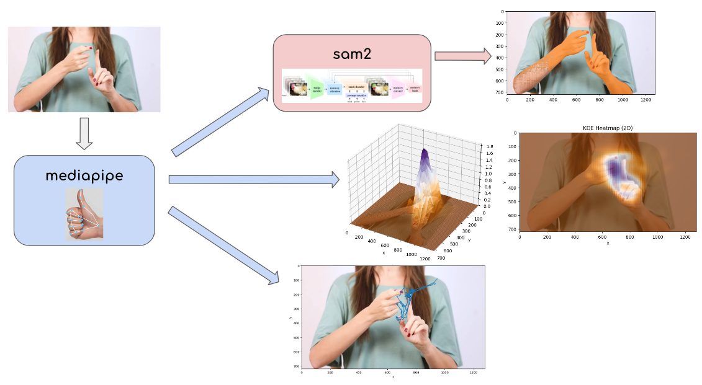

# Stroke Detection Model

## Overview

This project extracts simple features from video to analyze differences in hand movements between stroke and non-stroke patients. By utilizing pre-trained foundational models, such as Mediapipe’s hand tracking and the SAM2 image segmentation model, we obtain key data features that form the basis for more advanced analyses of hand motion characteristics.



The project is organized into several stages:
1. **Object Segmentation**: Identifying hand movement in video feeds.
2. **Heatmap**: Visualizing the intensity and range of hand motion at a fixed area.
3. **Trajectory Tracking**: Tracking the path of the hand over time.
4. **Stroke Detection**: A naive attempt at detecting stroke through proxy metrics for movement expressiveness, such as calculating the L2 norm of hand motion across frames.

This work leverages spatial and temporal data signatures from video feeds to analyze a patient's "movement expressiveness." This is based on the fundamental observation that mobility and speed are often significantly limited in stroke patients.

---

## Introduction  

Understanding the subtle differences in hand movement between stroke and non-stroke patients is crucial for understanding the effectiveness of a stroke patient's recovery.

This project is based on the idea that video analysis can uncover key features of hand motion, offering a valuable method for assessing the motor function of stroke patients. The approach progresses through several stages, each building on the previous one to capture important signatures that provide insights into their recovery journey.

### Step 1: Hand Landmark Extraction and Segmentation
We begin with **hand detection**. Using Mediapipe's hand-tracking library, we can extract precise hand landmarks from video feeds. These landmarks will become foundational to study their movements in space and time. Once landmarks are extracted across frames of the sliced video feed, the data is fed into the **SAM2 image segmentation model**, which enables us to segment the hand motion within the video frames.

<div style="display: flex; justify-content: center; align-items: center; gap: 10px;">
  
  

</div>

<div style="display: flex; justify-content: center; align-items: center; gap: 10px;">
    <p style="margin-top: 15px;"><em>(Left) Normal patient, (Right) Stroke patient</em></p>
</div>


- [Notebook here: Non-stroke patient](./non-stroke-hand-segmentation.ipynb)
- [Notebook here: Stroke patient](./stroke-hand-segmentation.ipynb)

---

### Step 2: Motion Heatmaps

Leveraging these outputs across sliced frames, we obtain a sequence of observed data over space. This sequence can be analyzed statistically by examining the **frequency of hand positions in space**. This method employs a Gaussian Kernel Density Estimation (KDE) to derive hand motion heatmaps, providing a rough visualization of the intensity and spread of movement. These heatmaps are valuable for identifying spatial patterns of motion and areas of high activity.


- [Notebook here: Heatmaps](./heatmap.ipynb)

---

### Step 3: Trajectory Tracking

Next, data signatures across temporal frames enable the exploration of hand motion trajectories, which map the **movement path of the hand over time**. By visualizing these trajectories and analyzing their geometric patterns and complexity, we can potentially infer a patient's condition, uncovering patterns that distinguish the motions of non-stroke patients from stroke patients, which can be more limited.

[Notebook here: Trajectory tracker](./motion_tracker.ipynb)

---

### Step 4: Stroke Detection (a simplistic approach)

> A heuristic of motion expressiveness: Stroke patients often exhibit limited mobility and slower hand movements due to neurological damage as seen from an example video. By calculating the L2 norm of each hand landmark across frames, we can capture the "expressiveness" of movement in a quantifiable manner.

Building on the features that capture spatial and temporal movement patterns, we take an initial simple and intuitive approach to stroke detection. Using the geometric information obtained in Step 1, we can develop proxy metrics to quantify the movement expressiveness of stroke and non-stroke patients. One such intuitive metric is the L2 norm of each hand landmark across frames, which quantifies the magnitude of motion between consecutive frames.

### The "Motion Expressiveness" Score, $(\text{ExprScore})$
$\textbf{Assume a steady frame from the video feed}$

$\text{Let } V \in \mathbb{R}^{T \times H \times W \times C} \text{ denote the video feed, where } T \text{ is the number of sliced frames, and}$

$\quad \text{let } V[t] \in \mathbb{R}^{H \times W \times C} \text{ be an image frame of an }t\text{-th frame derived from a video feed, and}$

$\quad \text{let } h \text{ be the the } \textbf{"mediapipe"} \text{ model that outputs a tuple of hand landmarks for a given frame } V[t]$.

$\text{Specifically, }$ 

$$
h(V[t]) = ((x_1, y_1), (x_2, y_2), \dots, (x_{21x2}, y_{21x2}))
$$

$\text{Here we see a total of 21 } \times \text{2 coordinates, derived from a total of 21 landmarks per hand ( } \times \text{ 2 if both hands are in frame)}$


</br>

$\textbf{Assume both hands are in frame}$

$\text{Let } N \text{ be the total number of frames in a video feed.}$

#### "Average Movement Deviation" $m(\delta)$

$\text{We compute the arithmetic mean of the L2 norms for each hand landmark across all consecutive frames.}$


$\text{Let } i \text{ be the index to the Cartesian coordinates of a specific hand landmark}$

$\quad \text{(e.g., Landmark 0 }, h(V[t])[0] \text{ corresponds to the "left wrist" at video frame, } t \text{), and}$

$\quad \tilde{\delta}_{i} \text{ be a random variable representing the deviation of the } i\text{-th hand landmark across successive frames.}$

$$
m(\tilde{\delta_{i}}) = \frac{\sum_{t=1}^{N-1} \lVert h(V[t])[i] - h(V[t+1])[i] \rVert_{2}}{N-1}, \quad \forall i
$$

$(N-1 \text{ because of consecutive frame intervals})$

$\text{This computation yields a tuple of mean deviations for each hand landmark:}$

$$
(m(\tilde{\delta}_1), m(\tilde{\delta}_2), \dots , m(\tilde{\delta}_n)) \text{ where } n = 21 \times 2
$$

$\text{Then, we can define the final expression score as:}$

$$
\text{ExprScore} = \sum_{i=1}^{21 \times 2} m(\tilde{\delta}_i).
$$


This concludes our simplistic scoring method.


- [Notebook here: a simple heuristic measure](./stroke_heuristic.ipynb)

---

(**Futurework**): 
1. With more data, these relative scores can be studied using unsupervised learning techniques, such as clustering to identify patterns and group patients based on their movement characteristics. This approach could enable us to track the progress of healthy vs non-healthy individuals and provide a quantitative means for monitoring rehabilitation progress in patients with hand mobility issues.
2. We can introduce the z-depth of hand landmarks to capture additional spatial information. 
3. Hand landmark features can be trained as a binary classification problem --- stroke vs non-stroke --- using deep learning models. 


**Conclusion**: This workflow utilizes techniques to extract insights from video data, focusing on spatial and temporal semantics. By combining these techniques, we can perform motion analysis to uncover critical movement signatures and monitor the progress of task like stroke rehabilitation. 


---

## Let's get started!: 

### Prerequisites
- Python 3.12
- AnaConda installed on your machine

### Steps

1. Clone the repository:
```bash
git clone <repository_url>
cd <repository_name>
```

2. Create and activate a Conda environment:
```bash
conda create -n sam2 python=3.12 -y
conda activate sam2
```

3. Install the required dependencies:

```bash
pip install -r requirements.txt
```

4. Import the hand_tracker module:
```bash
import hand_tracker as ht
```

